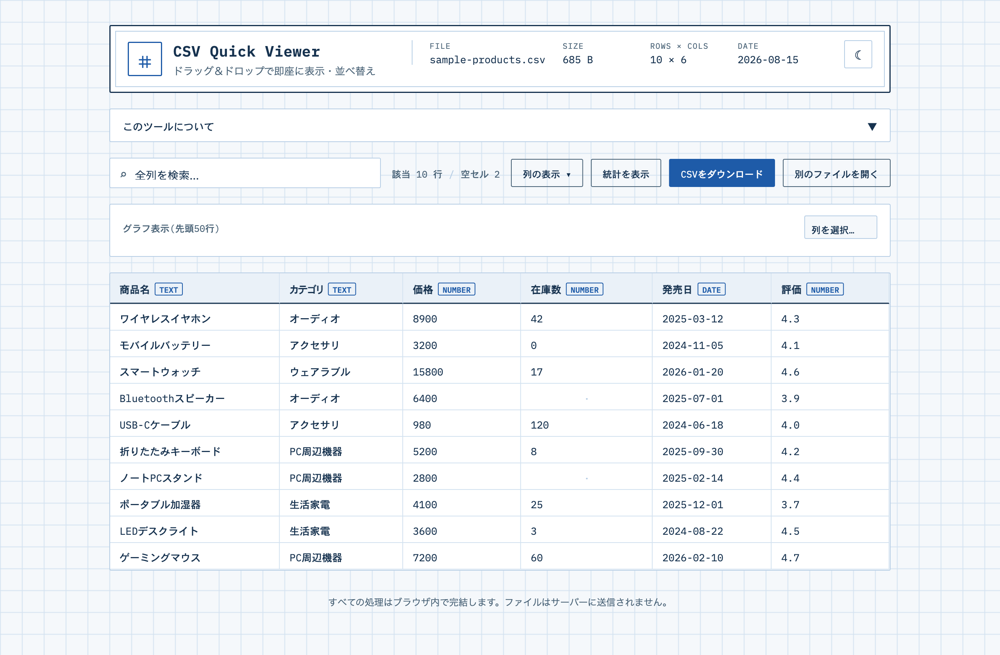

# CSV Quick Viewer

CSVファイルをドラッグ＆ドロップするだけで、その場でテーブル表示・ソート・検索・グラフ化ができるツールです。すべての処理はブラウザ内で完結し、ファイルはどこにも送信されません。

- 公開URL: https://yukisatodev.github.io/csv-quick-viewer/（手元にCSVがなくても「サンプルデータを試す」で確認できます）
- 設計判断の詳細: [csv-quick-viewer-DECISIONS.md](csv-quick-viewer-DECISIONS.md)



---

## 🎯 採用担当の方へ（30秒で分かる要約）

**これは何か**：CSVをドラッグ&ドロップするだけで、サーバーに一切送信せずブラウザ内だけで表示・検索・集計・グラフ化までできるツールです。[サンプルデータですぐ試せます](https://yukisatodev.github.io/csv-quick-viewer/)。

このプロジェクトから伝わればと思っている点です。

- **「安心して使える」をアーキテクチャで担保している**：社外秘データを誤ってアップロードしてしまうリスクをなくすため、あえてバックエンドを持たない設計にしました。機能追加ではなく設計判断でプライバシーを保証している点が伝わればと思います。
- **入出力が明確なロジックはテストで担保している**：列の型自動判定（`utils.js`の`inferType()`）のようなロジックはVitestでユニットテスト化し、GitHub Actionsでpushごとに自動実行しています。感覚だけに頼らない品質担保の意識です。
- **既存ライブラリと自作コードの線引きが明確**：CSVパースはPapaParse、グラフはRechartsと実績のあるライブラリに任せ、型判定・集計といった独自ロジックの実装に注力しています。何でも自作するのではなく、力を入れるべき場所を選んでいます。
- **ポートフォリオの中で次の作品につながる位置づけ**：この後に予定していたPythonバックエンド版CSVチェックツールの前段階として着手した、という制作の連続性も汲み取っていただければと思います。

---

## 1. 背景・課題

「とりあえず中身を見たいだけなのに、Excelを立ち上げるのは大げさ」という場面のための軽量ビューワーです。業務でCSVを扱う中で、

- 中身を見るためだけにExcel/スプレッドシートを開く手間
- 社外に出したくないデータを、うっかりオンラインのツールにアップロードしてしまうリスク

という2つの小さな不満を解消することを目的に、フリーランスとしてのポートフォリオの一つ、かつ次に予定していたPythonバックエンド版CSVデータチェックツールの前段階として着手しました。

## 2. 要件定義

### 2.1 想定ユーザー

- ちょっとしたCSVの中身をすぐ確認したいエンジニア・非エンジニア
- 社外秘データを含むCSVを、外部サーバーに送らずに確認したい業務担当者

### 2.2 機能要件

| ID | 要件 | 対応状況 |
|---|---|---|
| F-1 | CSVファイルをドラッグ＆ドロップ、またはクリックで選択して読み込める | ✅ |
| F-2 | サンプルデータ・公開URLからも読み込める | ✅ |
| F-3 | 列ごとの型（number / date / text / empty）を自動判定してテーブル表示する | ✅ |
| F-4 | 列ヘッダのクリックでソート（昇順→降順→解除）できる | ✅ |
| F-5 | 全列を対象にリアルタイム検索・絞り込みができる | ✅ |
| F-6 | 列の表示/非表示を切り替えられる | ✅ |
| F-7 | 列ごとの統計サマリー（数値: min/max/avg、文字列: ユニーク数、共通: 欠損数）を表示する | ✅ |
| F-8 | 数値列を簡易棒グラフで確認できる | ✅ |
| F-9 | 絞り込み・並べ替え後の結果をCSVとして再ダウンロードできる | ✅ |
| F-10 | ダークモードを切り替えられる | ✅ |

### 2.3 非機能要件

| 区分 | 内容 |
|---|---|
| プライバシー | ファイルをサーバーに送信しない。パース・集計・グラフ描画まですべてブラウザ内（クライアントサイド）で完結させる |
| 信頼性 | 型判定ロジックのように入出力が明確な処理は、Vitestによるユニットテストで担保し、GitHub Actionsでpushごとに自動実行する |
| 運用コスト | バックエンドを持たないため、サーバー費用が発生せず、GitHub Pagesのみで公開が完結する |

## 3. 型判定・集計ロジック

`utils.js`の`inferType()`が、各列の先頭30件のサンプル値から型を判定する。

| 型 | 判定条件 |
|---|---|
| `number` | サンプルが全て数値に変換できる |
| `date` | サンプルが全て`Date.parse`可能 |
| `text` | 上記いずれにも当てはまらない |
| `empty` | サンプルが1件もない（全行が空） |

型ごとに`computeColumnStats()`が統計を算出する（数値: min/max/avg、日付: min/max、文字列: ユニーク値の件数、いずれも欠損数）。

## 4. 技術選定

| 技術 | 採用理由 |
|---|---|
| React + Vite | ビルドの速さと、UIの状態管理のしやすさ |
| [PapaParse](https://www.papaparse.com/) | CSVパースはクォート処理・改行コード・エンコーディングなど考慮点が多く、実績のあるライブラリに任せてUI/UXの実装に注力するため |
| [Recharts](https://recharts.org/) | 宣言的にグラフを組めるため、簡易棒グラフの実装コストを抑えるため |
| Vitest + GitHub Actions | 型判定ロジックのような入出力が明確な部分をテストコードで担保し、変更のたびに手動で全機能を確認する手間を減らすため |

バックエンドを持たない設計にしたのは、「ファイルを送信しない」という安心感自体を設計で担保するため。副次的にサーバー費用も発生しない。

## 5. セットアップ

```bash
npm install
npm run dev
```

## 6. テスト

```bash
npm run test
```

## 7. デプロイ（GitHub Pages）

```bash
npm run deploy
```

`vite.config.js`の`base`は`/csv-quick-viewer/`を指定している。リポジトリ名を変える場合はここも合わせて変更する。

デプロイ後、リポジトリの Settings → Pages → Source を `gh-pages` ブランチに設定すると`https://<username>.github.io/csv-quick-viewer/`で公開される。

## 8. 今後の課題

- 数十万行を超える大規模ファイルへの対応（仮想スクロール等）。現状はブラウザのメモリに収まる範囲を想定
- 複数ファイルの比較表示
- 列の型を手動で上書きできる機能（自動判定が誤る場合のフォールバック）
